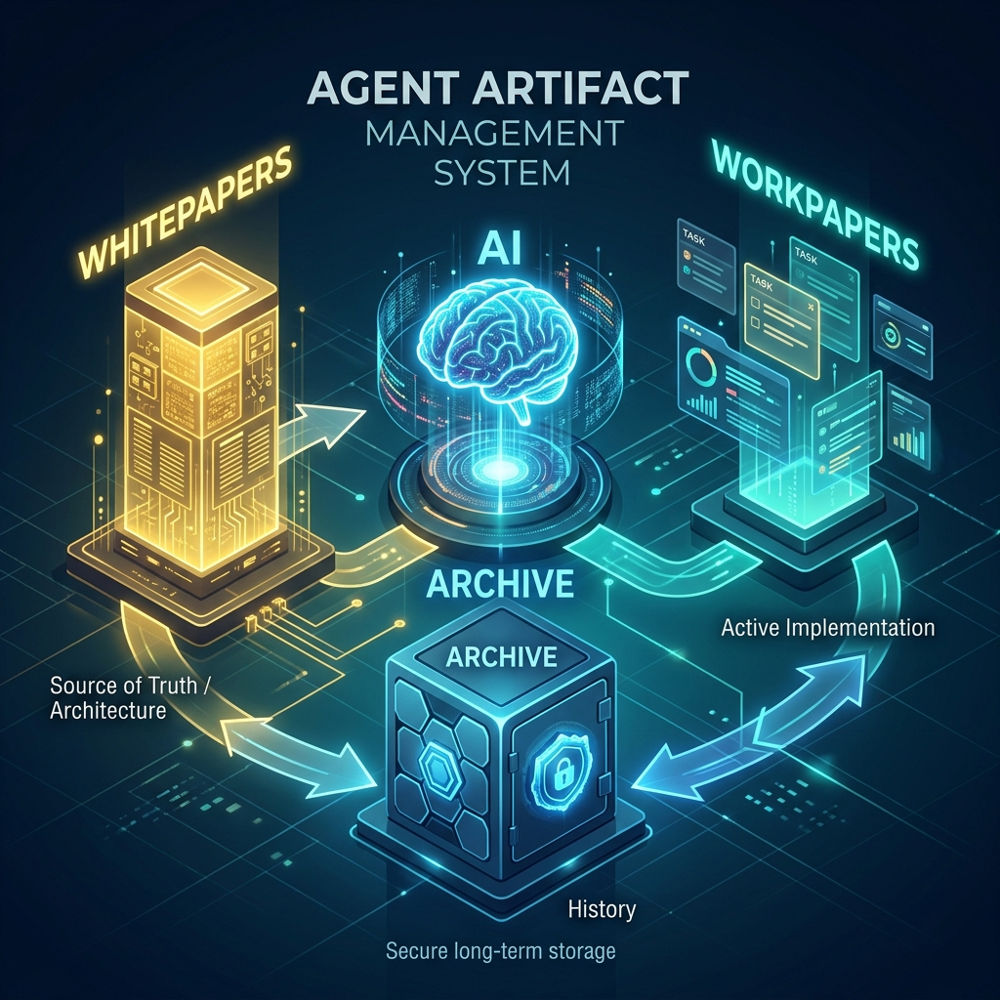

# 🏟️ OS-Arena

**OS-Arena** ist ein reiner Browser-Client, um schmale, offene KI-Modelle (Open-Weight Models) direkt lokal gegeneinander antreten zu lassen. Alles passiert **100% lokal** auf deinem Gerät – ohne Cloud-Zwang, ohne API-Kosten und mit maximaler Privatsphäre.

## ✨ Features
- **Direkter Modell-Vergleich**: Wähle zwei KIs und lass sie dieselbe Frage beantworten. Stimme ab, wer besser ist!
- **WebGPU-Powered**: Die KI läuft dank `@mlc-ai/web-llm` extrem performant direkt über deine lokale Grafikkarte. (Robuster Hardware-Check integriert).
- **Offline fähig**: Einmal heruntergeladene Modelle werden lokal im Cache (IndexedDB) deines Browsers zwischengespeichert. So kannst du die Arena – solange der Cache nicht geleert wird – auch ohne Internetverbindung nutzen.
- **Mobile-First Design**: Moderne, reaktionsschnelle Benutzeroberfläche (Glassmorphism), die auf jedem Endgerät optimal funktioniert.
- **PWA-Ready**: Installiere die OS-Arena als eigenständige App direkt auf deinen Desktop oder dein Smartphone.
- **Privacy First & "No-Key" Security**: Deine Prompts verlassen niemals dein Gerät. Unsere Architektur verzichtet auf API-Keys im Frontend. Kommunikation erfolgt sicher und anonym über gesicherte Gatekeeper.
- **Globales Performance-Ranking**: Vergleiche deine WebGPU-Leistung optional und anonym mit der weltweiten Community.
- **System-Monitoring & Transparenz**: Echtzeit-Anzeige von WebGPU-Status, Browser-RAM-Verbrauch und detailliertem Download-Fortschritt.

## 🚀 Integrierte Modelle
Die Arena nutzt für den Browser kompilierte Modelle (WebML-Community). Wir setzen auf das **3B-Limit**, um den idealen Mix aus Qualität und Speed zu bieten:

- **Llama 3.2 3B**: Der Champion. Erstaunliche Intelligenz für ein lokales Browser-Modell.
- **Gemma 2 2B**: Googles Präzisions-König. Überlegene Reasoning-Fähigkeit und Textqualität.
- **SmolLM2 (1.7B)**: Der Logik-Spezialist. Extrem stark in Mathe, Code und STEM-Aufgaben.
- **Llama 3.2 1B**: Der vielseitige Allrounder für schnellere Chats.
- **Qwen 2.5 (0.5B - 1.5B)**: Das Effizienz-Wunder von Alibaba. Exzellente Mehrsprachigkeit.
- **TinyLlama (1.1B)**: Unser "Negativ-Beispiel" für Speed-Tests (schnell, aber schwache Logik).


## 🛠️ Lokales Setup für Entwickler

Da die App als reine Frontend-Applikation läuft, benötigst du kein Backend:

```bash
# 1. Repository klonen
git clone https://github.com/DEVmatrose/os-arena.git
cd os-arena

# 2. Abhängigkeiten installieren
npm install

# 3. Entwicklungsserver starten
npm run dev
```

## 🌐 GitHub Pages Deployment
Dieses Projekt ist "Serverless" und dafür ausgelegt, direkt via GitHub Pages gehostet zu werden.
Es gibt eine fertige GitHub Action (`.github/workflows/deploy.yml`). Sobald du diese in deinem Repo aktivierst, wird bei jedem Push auf den `main` Branch automatisch die App gebaut und auf GitHub Pages bereitgestellt.

## ⚠️ Systemanforderungen für Nutzer
Damit die KI im Browser läuft, wird Folgendes benötigt:
- Ein moderner Webbrowser (empfohlen: **Google Chrome** oder **Microsoft Edge**).
- **WebGPU** muss unterstützt und aktiviert sein (falls es standardmäßig nicht aktiv ist, im Browser `chrome://flags/#enable-unsafe-webgpu` auf Enabled setzen).
- Speicherplatz: Beim erstmaligen Laden werden die Modelldaten im Browser-Cache gespeichert (ca. 0.5 bis 2 GB pro Modell).

## 📄 Lizenz & Beitrag
Dieses Projekt ist Open Source. Fühle dich frei, die Arena zu forken, Pull Requests zu erstellen oder eigene Modelle (`q4f16_1-MLC`) hinzuzufügen!

## 🧠 AAMS - Agent Artifact Management System
Die Entwicklung der OS-Arena folgt dem **[AAMS-Prinzip](https://github.com/DEVmatrose/AAMS)**. Dies stellt sicher, dass die Zusammenarbeit zwischen Mensch und KI strukturiert, dokumentiert und jederzeit nachvollziehbar bleibt.



- **Whitepapers**: Architektur-Entscheidungen und "Source of Truth".
- **Workpapers**: Aktuelle Aufgaben und Implementierungsschritte.
- **Archive**: Dokumentation abgeschlossener Meilensteine.

## ⚖️ Disclaimer & Haftungsausschluss
Dies ist ein **privates Projekt**. Die Nutzung der OS-Arena erfolgt auf eigene Gefahr und Verantwortung. 
- **Keine Gewähr**: Es wird kein Anspruch auf Funktionalität, Support oder Datensicherheit erhoben.
- **Datenschutz-Garantie**: Ich garantiere, dass bei Standardnutzung keine Daten dein Gerät verlassen. Die Anwendung ist konsequent auf lokale Autonomie ausgelegt.
- **Verantwortung**: Jeder Nutzer ist für die Einhaltung lokaler Gesetze und die Verwendung der generierten Inhalte selbst verantwortlich.

## 💬 Austausch & Feedback
Ich freue mich über jede Form von Austausch! Ob Bug-Reports, Feature-Ideen oder einfach nur ein Gespräch über die Zukunft der lokalen KI – melde dich gerne über GitHub Issues oder direkt bei mir.

*Gebaut mit 🤖 Support für maximale Entwickler-Effizienz.*
