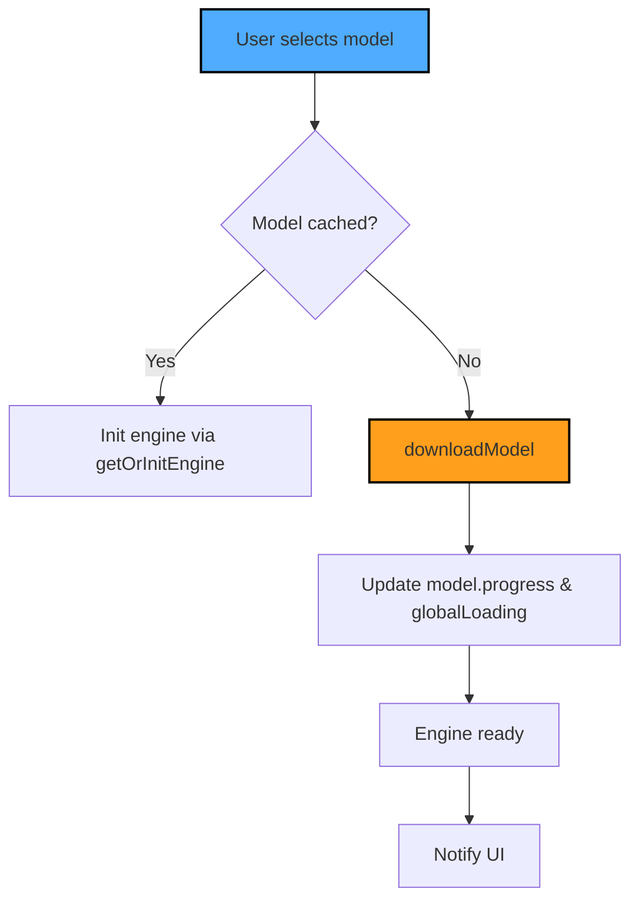

# WP-006 Refactor: Loading UI & System Info

## Zielsetzung

- **Visuelle Feedback‑Schleife** für Modell‑Downloads, damit der Nutzer während des Ladens weiter interagieren kann.
- **Mehrere gleichzeitige Downloads** (z. B. Arena‑Modell A & B) werden klar angezeigt.
- **System‑Technik‑Panel** in den Settings, das GPU‑/RAM‑Informationen, Cache‑Status und aktuelle Ladevorgänge zeigt.
- **Premium‑Design** – gläserne Panels, dezente Mikro‑Animationen, harmonische Farbpalette (Dunkel‑Modus, Gradient‑Header).

---

## 1. UI‑Komponenten

| Komponente | Zweck | Design‑Hinweise |
|------------|------|----------------|
| `LoadingOverlay.vue` | Vollbild‑Overlay, das automatisch erscheint, wenn `state.globalLoading` true ist. | Glass‑Panel, zentrierter Fortschritts‑Ring + Text. Mikro‑Fade‑In/Out. |
| `LoadingStatusBar.vue` | Kleine, einklappbare Leiste in den Settings. Zeigt aktuelle Modell‑Downloads (Name, Fortschritt, Status). | Horizontaler Balken, animierte Farbverläufe, `v-show` / `v-if` basierend auf `model.loading`. |
| `SystemInfoPanel.vue` | Zeigt GPU‑Verfügbarkeit, verfügbare RAM (falls über `performance.memory`), Modell‑Cache‑Status. | Grid‑Layout, Icons, Tooltip‑Erklärungen, Dark‑Mode‑Farben. |

---

## 2. State‑Erweiterungen (`src/state.js`)

```js
// bestehende reactive‑Props erweitern
globalLoading: false,               // Overlay aktiv?
globalLoadingStatus: '',            // Text für Overlay
globalLoadingProgress: 0,           // 0‑100 % für Overlay
// neue Props für System‑Info
gpuInfo: null,                      // {supported: bool, adapterInfo: string}
ramInfo: null,                      // {totalMB: number, usedMB: number}
```

- Beim Aufruf von `checkCacheStatus()` wird zusätzlich `gpuInfo` befüllt.
- RAM kann über `performance.memory` (falls unterstützt) ermittelt werden.

---

## 3. Ablauf‑Diagramm (Mermaid)



---

## 4. Layout‑Integration

- **Settings‑Seite (`SettingsView.vue` oder neu zu erstellende `Views/SettingsView.vue`)**
  - Oberer Abschnitt: `SystemInfoPanel`.
  - Darunter ein Accordion‑Element `Lade‑Übersicht` → `LoadingStatusBar`.
- **Arena‑View** nutzt weiterhin `state.globalLoading` für ein Full‑Screen‑Overlay, das über `LoadingOverlay.vue` gerendert wird.

---

## 5. Styling‑Token (in `src/assets/styles/variables.css` oder direkt im Component‑Scoped‑Style)

```css
:root {
  --primary-gradient: linear-gradient(90deg, #4facfe, #00f2fe);
  --accent-gradient: linear-gradient(90deg, #ff9f1c, #ff4e50);
  --glass-bg: rgba(0,0,0,0.45);
  --glass-border: rgba(255,255,255,0.2);
}
```

- Verwende `backdrop-filter: blur(12px);` für Glas‑Effekte.
- Progress‑Bar: `background: var(--accent-gradient);` mit `transition: width 0.3s ease;`.

---

## 6. Mikro‑Animationen

- **Fade‑In/Out** für Overlay (`opacity` + `scale`).
- **Pulsierender Ring** während `globalLoading` (CSS‑Keyframes).
- **Bar‑Wachstum** animiert über `width`‑Transition, sobald `model.progress` aktualisiert wird.

---

## 7. Dokumentations‑ und Test‑Plan

1. **Unit‑Tests** für State‑Mutationen (Jest + Vue‑Test‑Utils).  
2. **E2E‑Tests** (Cypress) prüfen, dass das Overlay korrekt erscheint und verschwindet, wenn mehrere Modelle gleichzeitig geladen werden.
3. **Accessibility** – ARIA‑Live‑Region für Fortschritts‑Text, damit Screen‑Reader Nutzer informiert werden.
4. **Performance‑Audit** – Lighthouse‑Check, um sicherzustellen, dass das Overlay keine render‑blocking‑Kosten verursacht.

---

## 8. Nächste Schritte (To‑Do‑Liste)

- [x] Komponenten (`LoadingOverlay.vue`, `LoadingStatusBar.vue`, `SystemInfoPanel.vue`) implementieren.
- [x] State‑Objekt anpassen und GPU/RAM‑Erkennung hinzufügen.
- [x] Settings‑View einbinden und Layout‑Anpassungen vornehmen.
- [x] Styling‑Token in Design‑System aufnehmen.
- [x] WebGPU Fix: Fallback für `requestAdapterInfo` (Brave/Chrome Kompatibilität).
- [x] Refactor Download-Bereich (ModelsView).
- [x] Tests & Dokumentation ergänzen.

> **Hinweis:** Alle UI‑Entscheidungen folgen dem bestehenden Premium‑Design‑System des Projekts (Glass‑Panel, dunkle Hintergründe, klare Typografie mit Google‑Font *Inter*).
